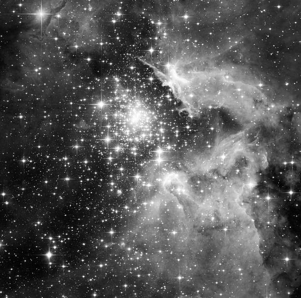
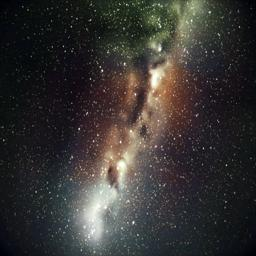
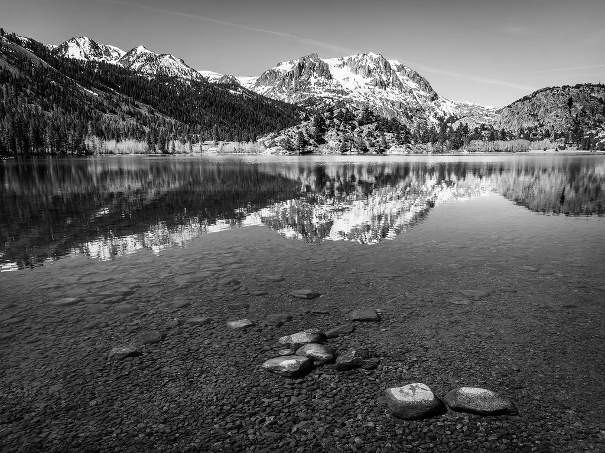
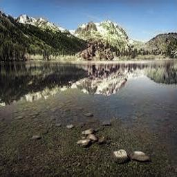
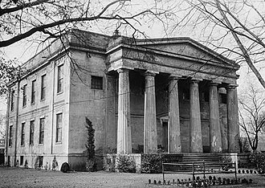

# G2C: Gray-to-Color Image Colorization

**G2C** (Gray-to-Color) is a PyTorch-based **classification-driven** image colorization pipeline that converts a single-channel grayscale (L) image into a vibrant, realistic RGB image by predicting one of 313 quantized a\*/b\* color bins.  

This project is a re-implementation and extension of Zhang et al.’s ECCV 2016 paper [“Colorful Image Colorization”](https://arxiv.org/abs/1603.08511).
  

## Repository Structure

```
g2c/
├── README.md
├── LICENSE
├── setup.py
├── helper.py
├── training.ipynb
├── inference.ipynb
├── assets/
│   ├── ab_clusters.npy      ← 313 Lab-space centroids
│   ├── cluster_counts.npy   ← per-cluster pixel counts for weighting
│   └── images/
│       ├── grayscale/
│       └── colorized/
├── data/
│   └── README.md
└── model/
    ├── README.md
    ├── __init__.py
    └── model.py
```


## Installation
1. **Clone** this repo:
   ```bash
   git clone https://github.com/nikhil-405/g2c.git
   cd g2c
   ```
2. **Install** the package:
   ```bash
   pip install -e .
    ```

## Data
See [Data README](data/README.md) for instructions on how to download and prepare your dataset.

## Model 
 - See [Model README](model/README.md) for details on the model architecture, hyperparameters, and training procedure.

 - The trained model weights can be found at this Hugging Face repository: [G2C Model Weights](https://huggingface.co/nikhil-405/g2c).

## Examples

Below are sample results demonstrating how G2C transforms grayscale images into vibrant, colorized versions. Implicit evaluation over some images on the internet.

### Sample Results

<table align="center">
  <tr>
    <td align="center" width="350"><b>Original Grayscale</b></td>
    <td align="center" width="350"><b>G2C Colorized Output</b></td>
  </tr>
  <tr>
    <td align="center" width="350">
      
    </td>
    <td align="center" width="350">
      
    </td>
  </tr>
  <tr>
    <td align="center" width="350">
      
    </td>
    <td align="center" width="350">
      
    </td>
  </tr>
  <tr>
    <td align="center" width="350">
      
    </td>
    <td align="center" width="350">
      
    </td>
  </tr>
  <tr>
    <td align="center" width="350">
      
    </td>
    <td align="center" width="350">
      
    </td>
  </tr>
  <tr>
    <td align="center" width="350">
      
    </td>
    <td align="center" width="350">
      
    </td>
  </tr>
  <tr>
    <td align="center" width="350">
      
    </td>
    <td align="center" width="350">
      
    </td>
  </tr>
</table>

## Usage
### Training
You can follow along with the [training notebook](training.ipynb) to train the model on your dataset. The notebook provides step-by-step instructions for setting up the training environment, loading data, and monitoring training progress.

### Inference
You can use the [inference notebook](inference.ipynb) to colorize grayscale images. The notebook allows you to input either local image files or URLs, and it will output the colorized images.

## License
This project is released under the MIT License. See [LICENSE](LICENSE) for details.

## Acknowledgements
This project is inspired by the work of Zhang et al. in their paper [“Colorful Image Colorization”](https://arxiv.org/abs/1603.08511).
